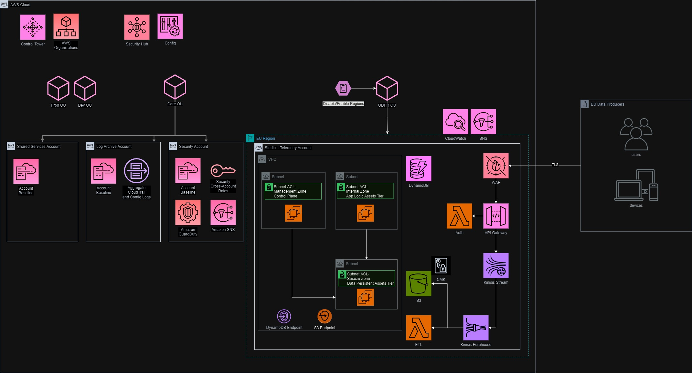

# aws-game-telemetry
AWS architecture for ingestion of GDPR game telemetry data. 

# AWS Data Ingestion and Processing Solution

## Overview

This solution is designed to handle data ingestion through an API Gateway, protected by a Web Application Firewall to mitigate common web app attacks, exploits, and bots. The architecture is serverless and event-driven. Client requests are authenticated via Lambda authorizer against IAM, with authorization using API keys. Application configuration data stored and API keys for registered apps are kept in DynamoDB. 

I was inspired to adapt this solution as a project after being asked about it during an interview. I was asked through a governance and security lens, and it got me thinking deeply about the architecture as a whole; I did some research and found [AWS guidance](https://aws.amazon.com/solutions/implementations/game-analytics-pipeline/) and templates for this exact project. 

The architecture diagram you see here represents my desire to shift the focus slighly by abstracting away from the code enough to incorporate GRC and Security Architecture, while still describing the interactions and considerations between services as whole. With such a cool serverless event-driven solution, zooming out like this gives is a great opportunity to demonstrate the importance and benefits of building GRC and Security best practices into your foundations. 

## Nice options
Integrating Kinesis with the game client allows authentication and authorization using a Cognito Identity Pool to provide temporary credentials for API access, and no longer requires the API gateway solution.

## How it works
Data is written to a Kinesis data stream, and further transformation and transfer are performed by Kinesis Firehouse and Lambda.

Storage options include an encrypted S3 bucket, DynamoDB table, or other supported options like Datadog based on the specific requirements of the solution.

Consumption and analysis can be performed natively using Athena and QuickSight or other analytic tools.

## Governance

Multi-account management and orchestration are achieved using AWS Control Tower and Organizations, using frameworks of your choice such as the well-architected framework, CIS controls, and GDPR and utilizing policy guardrails organization wide from a central place. Security Hub and Config are enabled in the organization to facilitate security analysis and compliance with best practices and standards. Accounts are segregated by Organizational Unit (OU), and policies are applied at the OU level where possible, especially Service Control Policies (SCPs). The GDPR OU contains telemetry accounts for each business unit, limited to the EU region.

## IAM 

IAM goes deep and needs a separate architecture description to be complete, but at a high level: 
- Analyst access is provisioned using least-privileged Role-Based Access Control (RBAC) entitlements via IAM and KMS policies/grants. 
- Users and their tools assume/are assigned a role that gains entitlements from membership, enabling read access to the bucket, table, schema, etc.
- All inter-service communication and actions are governed by IAM service roles with least-privileged permissions and key policies/grants.

## Data Security

Customer-managed keys using AWS KMS and certificates for custom domains in API URIs via ACM. Encryption in transit via TLS from the client to HTTPS endpoints. Streams are encrypted with KMS. Encryption at rest is implemented using Customer-managed keys in KMS for S3 and DynamoDB.

## Network Security

Any EC2 assets required exist in the appropriate security zones, partitioned by subnet and Network Access Control Lists (NACLs). There is no VPC internet access, so any calls to S3 or DynamoDB from inside the VPC use Gateway Endpoints. Management zone assets can be accessed via variety of methods such as VPC peering, transit gateway, endpoints, and VPN. 

## Monitoring and Metrics

CloudWatch and Simple Notification Service (SNS) for monitoring and alerting.

